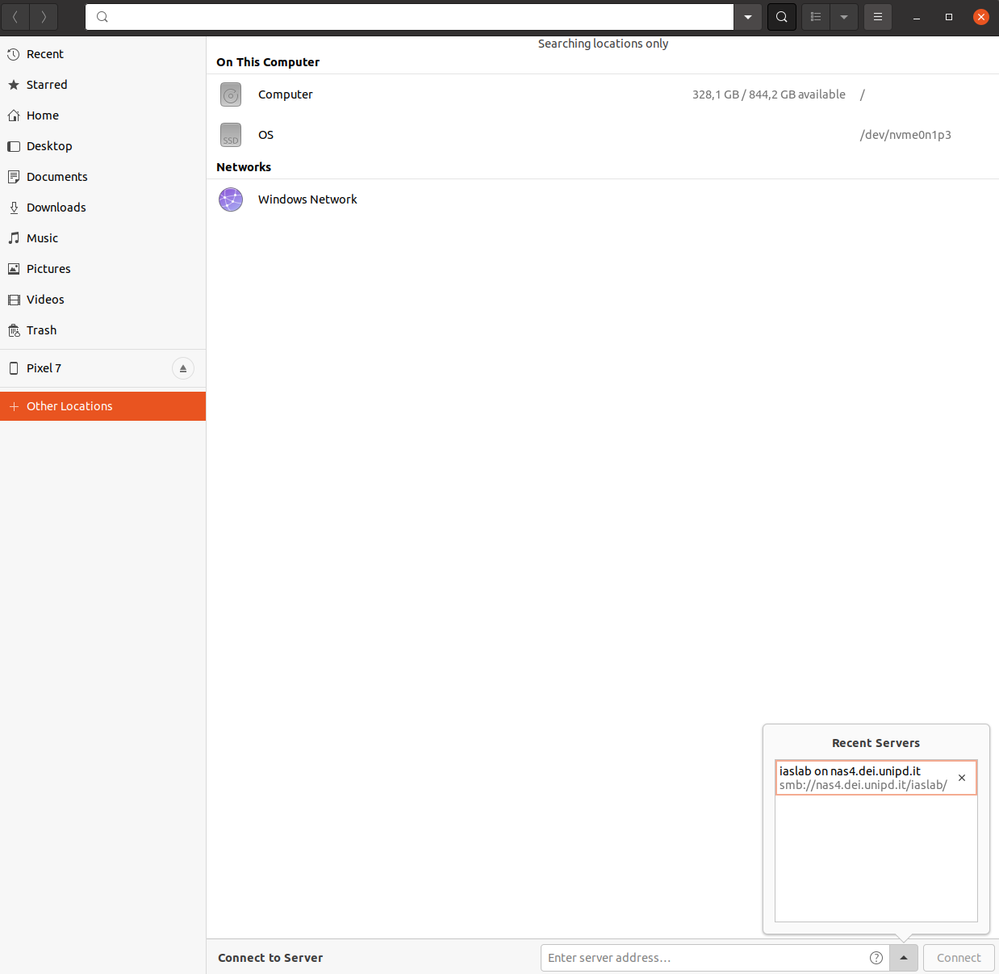

# Instruction to use DEI Cluster @ iaslab

The following instructions are meant to iaslab mambers. Please, refere to the complete [online guide](https://clusterdeiguide.readthedocs.io/en/latest/) for all the deatils. 

The cluster works using SLURM scheduler. You are supposed to submit a job which will be managed by the scheduler and execute as soon as possible. 

# Preparing the code

We advise to test the code locally before submitting to the cluster. It is not straighforward to debug code on the cluster. 

Please prepare the github repository. 

# Preparing the Singularity container

Install singularity and prepare the container. Firslt, create a folder to compile the image container: 

```shell
mkdir image
cd image
```

For deep learning with Pytorch, you can rely on this example file `ubuntu_cuda.def`. It builds an Ubuntu 22.04 container with cuda 11.8 libraries (you can look for a different version in [Docker Hub](https://hub.docker.com/r/nvidia/cuda/tags) ). Add `pip install ...` to install the packages you need. 

```
BootStrap: docker
From: nvidia/cuda:11.8.0-cudnn8-devel-ubuntu22.04

%post
    apt update -y
    apt install -y python3.8
    apt update -y
    apt install -y pip
    apt update -y
    pip install numpy==1.21.6
    pip install torch==1.13.0
    pip install torchvision==0.14.0

%environment
   export LC_ALL=C

%runscript

```

Build the image

```
 singularity build ubuntu_cuda.sif ubuntu_cuda.def
```
Build the image with `sudo` commands in the `.def`:
```
 singularity build --fakeroot ubuntu_cuda.sif ubuntu_cuda.def
```

There are also other modalities, please refer to this [guide](https://guiesbibtic.upf.edu/recerca/hpc/building-singularity-containers). 

### Note
The image in the example (nvidia/cuda:11.0.3-cudnn8-devel-ubuntu20.04) is old but working.
<br>
If you need another image, you can refer to the complete list at [Nvidia hub](https://hub.docker.com/r/nvidia/cuda/tags?).


### Troubleshooting
 - If you get stuck during image building at the choice of Geographic area, in particular during "Configuring tzdata", just paste the following lines immediately after the "From: ..." command
    ```
    export TZ=Europe/Rome
    RUN ln -snf /usr/share/zoneinfo/$TZ /etc/localtime && echo $TZ > /etc/timezone
    ```
   and re-build


# Prepare the cluster environment in the cluster

Access to your DEI account

```shell
ssh youraccount@login.dei.unipd.it

```
In your home you have only 5GB, if you need more space, you should access our NAS. 
```shell
cd /nfsd/iaslab4/Users/your_surname
```
If the folder with your surname does not exist, please create it.

> <u>Note</u>: you may have the permissions to create the folder, thus you can do this by yourself.<br>
But if you happen to not have the permissions, you need to open a ticket [here](https://www.dei.unipd.it/helpdesk/index.php).<br>
You will found it easier in the <u>italian version</u> (the english version lacks some options).<br>
After login, go to "pagina iniziale">"Cluster calcolo dipartimentali (Blade/Razor)"<br>
In the "Riassunto" field write "Accesso al NAS"<br>
In the body of the ticket, ask for the creation of the folder with your surname at the specific path and the permission to work on it.

Clone your repository with the code. Copy also the `.sif` image container in the repository folder (rembeer to update `.gitignore` file). 

## Copy file into your workspace folder

If you are inside DEI network, you can access the NAS through the file manager using samba. Please, refer to the following image:



If you are outside DEI network, use `scp` (`-r` will recursevely copy all the subfolders):

```shell
scp -r /path_to_resource ursername@login.dei.unipd.it:/nfsd/iaslab4/Users/your_surname/

```
### Mount a remote file system with GUI
```shell
mkdir ~/remote_cluster
sshfs -o ServerAliveInterval=60 youraccount@login.dei.unipd.it:/nfsd/iaslab4/Users/your_surname ~/remote_cluster
```

# Test a job locally

You can test the job locally by placing repo and .sif in the same folder.

#### In this example we mount the data folder and the code folder in two different places. Then, we run a python script passing also an argument that the script wants.

```
sudo singularity exec --bind [dataset path]:/data,[code path]:/mnt --pwd /mnt [sif name].sif --nv python3 train.py -d /data
```

# Manage a job

Prepare a `.slurm` file in `/nfsd/iaslab4/Users/your_surname` to submit a job. All the instructions and details can be found [here](https://clusterdeiguide.readthedocs.io/en/latest/UsingSLURM.html). Please, read it before submitting a job. 

You can use the following file as a reference example: 

```slurm
#!/bin/bash
#SBATCH -J [job_identifier_name]
#SBATCH -o %x_output.txt
#SBATCH -e %x_errors.txt
#SBATCH -t [expected execution time]
#SBATCH -n 1
#SBATCH -c [cpu core to be used]
#SBATCH -p allgroups
#SBATCH --gres=gpu:[required gpu]
#SBATCH --mem-per-cpu=[required RAM amount]
#SBATCH --mail-user [your email to receive notifications about job status]
#SBATCH --mail-type ALL
cd $WORKING_DIR

srun singularity exec --bind /nfsd/iaslab4/Users/[your_folder]/[your_repo]:/mnt --nv /nfsd/iaslab4/Users/[your_folder]/[your_repo]/[your_image].sif python3 /mnt/[your_script.py] 

```

Please substitute [] with your specs. 

Note the all the path by default refers to your `/home` directory. We use `--bind /nfsd/iaslab4/Users/[your_folder]/[your_repo]:/mnt` to simplfy the mapping. `/mnt` now is pseudonym for `/nfsd/iaslab4/Users/[your_folder]/[your_repo]`. All the path in your code must start with `/mnt`, otherwise the they will refer to `/home`. 

The `--nv` option is fundamental for enabling the nvidia enviroment, thus the usage of the gpu.

| Notable Slurm Fields | comment | example | meaning | 
| --- | --- | --- | --- | 
| -t [expected execution time] | different time formats are available (see [here](https://clusterdeiguide.readthedocs.io/en/latest/UsingSLURM.html#slurm-mandatory-options)) | t 05-03 | run for 5 days, 3 hours | 
| --gres=gpu:[required gpu] |  you must specify the [type](https://clusterdeiguide.readthedocs.io/en/latest/SLURMExamples.html#gpu-job) of the gpu that you want. | --gres=gpu:rtx |  use a single RTX gpu |
## Submit the job

To submit your job: 
```shell
sbatch your_file.slurm

```
To check the status you can use `%x_output.txt` (standard output) and `%x_errors.txt` (standard error). Basically they collect the info that normally are printed into the console. 

To get info about your job status, running time, etc..., you can also run: 
```bash
squeue -o "%.18i %.24j %.8u %.2t %.12M %.6D %.12l %.3C %.5m %.7b %R" | grep gpu
```
Here a legend of the command: 
- `%.18i` : Job ID
- `%.24j` : Job name
- `%.8u` : User name
- `%.2t` : Job state
- `%.10M` : Time used by the job
- `%.6D` : Number of nodes
- `%.10l` : Time limit set by the user
- `%.3C` : Number of CPUs requested
- `%.6m` : Minimum memory required
- `%R` : Node list (or reason the job is pending)
- `%.10b` : Job features (including GPUs)

Some status codes inlcude: 
- `COMPLETED CD`: 	The job has completed successfully.
- `COMPLETING 	CG`: 	The job is finishing but some processes are still active.
- `FAILED 	F`: 	The job terminated with a non-zero exit code and failed to execute.
- `PENDING 	PD`: 	The job is waiting for resource allocation. It will eventually run.
- `PREEMPTED 	PR`: 	The job was terminated because of preemption by another job.
- `RUNNING 	R`: 	The job currently is allocated to a node and is running.
- `SUSPENDED 	S`: 	A running job has been stopped with its cores released to other jobs.
- `STOPPED 	ST 	A`: running job has been stopped with its cores retained.


To cancel a job:
```shell
scancel [job_id]
```


